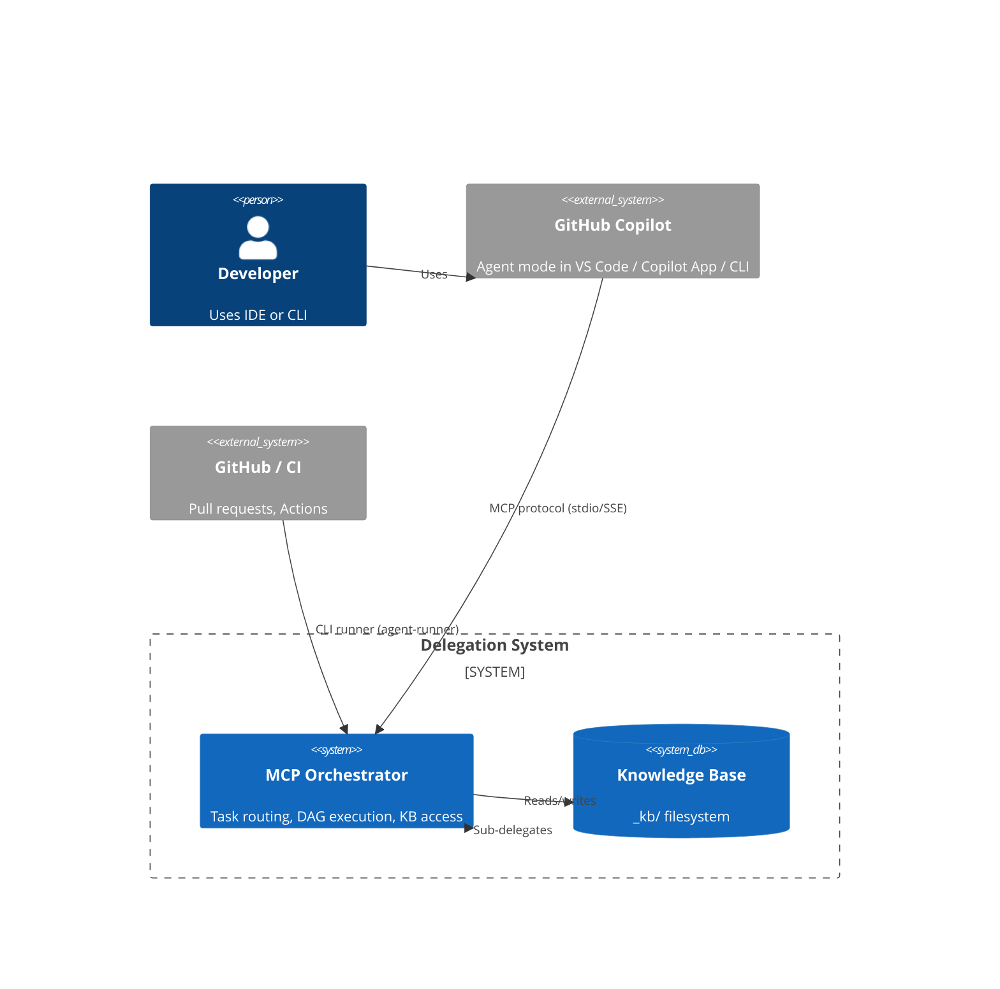

# Architecture Spine — Multi-Agent Model Delegation System

## Design Paradigm

**Orchestrator-based Task Routing.** A central MCP server owns the workflow graph: it receives a request (from an IDE agent or CI/CD trigger), resolves the target agent's config, and dispatches execution. For multi-step workflows the orchestrator evaluates a config-defined DAG, executing nodes in dependency order. Agents are leaf workers — they receive input via the knowledge base, produce output back to the knowledge base, and never coordinate directly with each other.

```
┌─────────────────────────────────────────────────────┐
│                   Entry Points                       │
│  ┌─────────────────┐  ┌───────────────────────────┐  │
│  │ MCP Client       │  │ CI/CD (GitHub Actions)    │  │
│  │ (Copilot/OC/VS)  │  │                           │  │
│  └────────┬────────┘  └───────────┬───────────────┘  │
│           │                       │                    │
│           ▼                       ▼                    │
│  ┌────────────────────────────────────────────────┐  │
│  │         MCP Orchestrator (single engine)         │  │
│  │                                                  │  │
│  │  ┌──────────┐  ┌──────┐  ┌──────────────┐      │  │
│  │  │Agent     │  │ DAG  │  │ Mirror        │      │  │
│  │  │Loader    │  │Engine│  │ Executor      │      │  │
│  │  └──────────┘  └──────┘  └──────────────┘      │  │
│  │  ┌──────────┐  ┌──────────┐  ┌────────────┐   │  │
│  │  │Task Queue│  │Sub-      │  │ Knowledge   │   │  │
│  │  │          │  │Delegator │  │ Base        │   │  │
│  │  └──────────┘  └──────────┘  └────────────┘   │  │
│  └────────────────────────────────────────────────┘  │
└─────────────────────────────────────────────────────┘
```

## Invariants & Rules

### AD-1 — Orchestrator-centric dispatch

[ADOPTED]

- **Binds:** All task routing and workflow execution
- **Prevents:** Peer-to-peer agent coordination, agents discovering or calling each other directly
- **Rule:** Every task enters through the orchestrator. Agents never invoke other agents directly — they call the `agent/delegate` MCP tool with target agent name and input payload. The orchestrator validates the target exists, enforces delegation depth limit (5), and enqueues a new task on the caller's behalf. The orchestrator is the sole authority on the workflow graph and agent roster. Delegate protocol: tool-based (JSON-RPC via MCP), not filesystem-based — no agent writes to `_kb/inbox/` for another agent.

### AD-2 — Dual entry, single engine

[ADOPTED]

- **Binds:** All entry points (IDE MCP client, CI/CD CLI runner)
- **Prevents:** Separate execution paths for local vs. CI usage diverging in behavior
- **Rule:** Both entry points load the same `DAGRunner`, `TaskQueue`, and `KnowledgeBase` instances from the same code path. The MCP server exposes tools (agent/run, task/*, kb/*); the CLI runner (`bin/agent-runner.ts`) instantiates the same engine directly. No runtime branching on the execution path.

### AD-3 — Agent config via `.agent.md` files

[ADOPTED]

- **Binds:** Agent registration, discovery, and configuration
- **Prevents:** A monolithic registry file, hardcoded agent roster, or database-backed registration
- **Rule:** Every agent is defined by a single `.agent.md` file in the `agents/` directory. The file carries YAML frontmatter validated against a canonical Zod schema (`AgentConfigSchema` in `schemas/agent-config.ts`). Schema fields: `name`, `model` (id, provider, params), `tools`, `permissions` (filesystem, network, env), `mirror`, `trigger` (event, filter), `dag`, `maxRetries`. The Markdown body serves as human-readable description (unvalidated). Discovery is file-system scan — no registration step. Adding an agent = adding a file.

### AD-4 — Config-driven DAG (no LLM in planning loop)

[ADOPTED]

- **Binds:** Workflow decomposition and execution ordering
- **Prevents:** An LLM deciding the task graph at runtime, introducing non-determinism, latency, and cost into the planning step
- **Rule:** The DAG is defined statically in YAML (inline to `agent/run` or in the agent config's `dag:` field). The orchestrator validates it (cycle detection via topological sort) and executes nodes in dependency order. No LLM call is made to plan, decompose, or sequence work. An optional TaskAnalyzer step (deferred) may later use LLM to generate a DAG from a high-level goal, but the executor itself remains config-driven.

### AD-5 — Knowledge base as agent communication backbone

[ADOPTED]

- **Binds:** Inter-agent data passing, output storage, audit trail
- **Prevents:** Inline context bloat between DAG steps, agents coupling to each other's output shapes, loss of state on crash
- **Rule:** Agents communicate through the filesystem knowledge base at `_kb/`. Each agent reads input (from the task payload or `_kb/inbox/`) and writes output (to `_kb/outbox/` or the task result). The KB is a shared filesystem — no database, no message queue. Downstream DAG nodes receive the previous node's output via the orchestrator's task-result forwarding (inline in the task payload), not by reading another node's outbox. However, agents *may* read any KB path they have permission for — this is a convention, not an enforceability gate. Subdirectories:

```
_kb/
  inbox/       # Task input payloads
  outbox/      # Agent output artifacts
  context/     # Persistent shared state (team preferences, learned data)
  sessions/    # Per-DAG-run scratch space (definition, logs, intermediate state)
```

### AD-6 — Sequential mirror protocol (primary → auditor → retry)

[ADOPTED]

- **Binds:** Quality assurance for agent outputs
- **Prevents:** Unreviewed agent output reaching downstream consumers; parallel mirror that cannot trigger revisions
- **Rule:** When an agent config declares a `mirror:` field, the orchestrator runs the mirror agent *after* the primary completes. The mirror receives an envelope `{ type: "audit", primaryAgent, primaryInput, primaryOutput }` and must return `{ status: "pass" | "fail" | "needs-revision", feedback: string }`. On `needs-revision`, the orchestrator retries the primary (up to `maxRetries`) with `_mirrorFeedback` attached to the retry input. On `fail` or exhausted retries, the task is marked failed. The mirror is synchronous and sequential — the DAG does not proceed past this node until the mirror resolves.

### AD-7 — Local-first deployment, SSE available

[ADOPTED]

- **Binds:** Deployment topology and connection model
- **Prevents:** Requiring a server daemon for local development; coupling to a specific MCP host
- **Rule:** The default transport is stdio (launched by the IDE's MCP client). SSE transport on port 3100 is available for remote MCP hosts (Copilot Desktop App, headless servers). Both use the same server code, selected by `--transport` flag. CI/CD runs via the CLI runner (`agent-runner`), which is a direct script invocation, not an MCP connection.

### AD-8 — Stack

[ADOPTED]

- **Binds:** Runtime, language, frameworks, persistence
- **Prevents:** Fragmentation across languages, unvalidated dependency choices
- **Rule:** All orchestrator code is TypeScript on Node.js 24 (Active LTS). Dependencies are pinned to the versions in the Stack table. The persistence layer defaults to in-memory; SQLite (`better-sqlite3`) is available for durable task storage. Zod is the single validation library. JWT verification uses `jose`. When upgrading major versions, verify compatibility with the MCP SDK and existing schema shapes.

### AD-9 — Unbounded parallel DAG execution

[ADOPTED]

- **Binds:** DAG executor concurrency model
- **Prevents:** An artificial parallelism limit that blocks ready nodes while resources are available
- **Rule:** The DAG executor runs all ready nodes (those whose dependencies are met) in parallel, with no configurable concurrency cap. Fan-out is unbounded. If backpressure becomes a concern (too many concurrent agent invocations), a concurrency limit can be added as a per-DAG option — but the default is unbounded parallelism.

### AD-10 — OAuth2 for SSE transport

[ADOPTED]

- **Binds:** SSE transport authentication
- **Prevents:** Unauthenticated access to the orchestrator when exposed over HTTP
- **Rule:** The SSE HTTP server supports OAuth2 Bearer token authentication via the `jose` library. Two verification modes are available: JWKS URI (`--auth-jwks-url`) for asymmetric keys, or symmetric secret key (`--auth-secret-key`) for shared-secret setups. Configurable issuer and audience claims. The `/sse` and `/message` endpoints require valid tokens when auth is enabled. The `.well-known/oauth-authorization-server` metadata endpoint is served for discovery. Stdio transport has no authentication.

## Consistency Conventions

| Concern | Convention |
| --- | --- |
| Naming | Agent configs: `<role>.agent.md` (e.g., `code-review.agent.md`). MCP tools: `domain/verb` (e.g., `kb/read`, `task/status`). Source modules: kebab-case directories, camelCase files matching exported class name. |
| Data & formats | All JSON-RPC communication follows MCP SDK types. Agent input/output is JSON. Task IDs are UUIDv4. Timestamps are Unix milliseconds (number). KB file paths use forward slashes. |
| State & errors | Task state machine: `queued → running → completed | failed | cancelled` (with retry: `failed → queued`). Invalid transitions throw. `cancelled` is a terminal state — no retry from cancelled. Error objects carry a string `message`; no typed error hierarchy for MVP. Logging goes to stderr (MCP convention). |

## Stack

| Name | Version | Notes |
| --- | --- | --- |
| Node.js | 24.x (Active LTS) | v24.18.0 "Krypton". Node 26.x is Current (LTS Oct 2026). |
| TypeScript | ~6.0.3 | TS 6.0 ships `using` declarations, improved ESM, breaking type changes from 5.x. |
| @modelcontextprotocol/sdk | ^1.29.0 | v2 in development (target July 28, 2026); pin at v1 until v2 stable and migration path documented. |
| zod | ^4.4.3 | v4 has breaking type changes from v3 — `z.object` inference differs. |
| better-sqlite3 | ^12.11.1 | Native addon — verify CI build environment has build tools. |
| js-yaml | ^5.2.0 | ESM-native in v5. `yaml.load()` API unchanged. |
| uuid | ^14.0.1 | Ships own types. `crypto.randomUUID()` in Node 24 may allow deprecating this. |
| jose | ^6.2.3 | OAuth2 JWT verification for SSE transport. ESM-native. |
| tsx (dev runner) | ^4.22.4 | For `tsx watch` during development. |

## Structural Seed

### System Context



### Source Tree

```
packages/mcp-orchestrator/
  src/
    index.ts              # CLI entry — detects project root, starts server
    server.ts             # MCPOrchestratorServer — wires all components, registers 8 tools
    schemas/
      agent-config.ts     # Zod schema for .agent.md frontmatter
      task.ts             # Task types, lifecycle, state machine
    loader/
      agent-loader.ts     # Scans agents/, parses frontmatter, validates
      config-cache.ts     # Generic in-memory cache
    dag/
      types.ts            # DAGNode, DAGDefinition, DAGRun, buildDAG, topologicalSort
      scheduler.ts        # scheduleDAG (batches by level), getReadyNodes
      executor.ts         # DAGExecutor — runs nodes in dependency order
      runner.ts           # DAGRunner — high-level API, writes session to KB
    queue/
      task-queue.ts       # TaskQueue — enqueue, waitForCompletion, retry
      persistence.ts      # InMemoryPersistence, SQLitePersistence
    kb/
      layout.ts           # KnowledgeBase — read/write/list/search with path traversal protection
      paths.ts            # KB directory constants
    tools/
      run-agent.ts        # tool: agent/run
      delegate-tool.ts    # tool: agent/delegate
      task-status.ts      # tool: task/status
      task-list.ts        # tool: task/list
      kb-read.ts          # tool: kb/read
      kb-write.ts         # tool: kb/write
      kb-list.ts          # tool: kb/list
      kb-search.ts        # tool: kb/search
    delegation/
      sub-delegator.ts    # SubDelegator — max-depth guard, enqueue target agent
    mirror/
      mirror-executor.ts  # MirrorExecutor — runs auditor, returns pass/fail/needs-revision
      retry-handler.ts    # RetryHandler — retry loop with mirror feedback
    auth/
      authenticator.ts    # OAuth2 JWT verification via jose (JWKS or symmetric key)
      middleware.ts       # SSE HTTP auth middleware, OAuth2 metadata endpoint
    ci/
      trigger-runner.ts   # EventTriggerRunner — matches events to agent triggers
    bin/
      agent-runner.ts     # CLI entry for CI/CD
agents/
  code-review.agent.md
  code-review-auditor.agent.md
  docs-sync.agent.md
  incident-response.agent.md
  meeting-prep.agent.md
  onboarding.agent.md
  system-builder.agent.md
_kb/
  inbox/
  outbox/
  context/
  sessions/
opencode.json             # OpenCode multi-agent config
.vscode/mcp.json           # VS Code Agent mode MCP binding
.copilot/mcp-config.json   # Copilot CLI MCP binding
.github/workflows/
  agent-delegation.yml     # CI/CD workflow triggers
```

### MCP Tool Surface

| Tool | Purpose | When to use |
| --- | --- | --- |
| `agent/run` | Run a single agent or a DAG workflow | Primary entry for all task execution |
| `agent/delegate` | Sub-delegate to another agent during execution | Called by agents, not by the entry point |
| `task/status` | Check task progress by ID | Polling after `agent/run` returns a taskId |
| `task/list` | List recent tasks (filterable by status, DAG run) | Monitoring / observability |
| `kb/read` | Read a file from `_kb/` | Agents retrieving input or shared context |
| `kb/write` | Write a file to `_kb/` | Agents publishing output |
| `kb/list` | List directory contents in `_kb/` | Discovery of available artifacts |
| `kb/search` | Full-text search across `_kb/` | Agents finding relevant context |

## Capability → Architecture Map

| Capability | Lives in | Governed by |
| --- | --- | --- |
| Task routing & dispatch | `MCPOrchestratorServer` + `TaskQueue` | AD-1, AD-2 |
| Agent registration & config | `AgentLoader` + `agents/*.agent.md` | AD-3 |
| Multi-step workflow execution | `DAGRunner` + `DAGExecutor` | AD-4 |
| Inter-agent data passing | `KnowledgeBase` + `_kb/` filesystem | AD-5 |
| Output quality validation | `MirrorExecutor` + `RetryHandler` | AD-6 |
| Entry point — IDE | MCP server (stdio transport) | AD-2, AD-7 |
| Entry point — CI/CD | `bin/agent-runner.ts` CLI | AD-2, AD-7 |
| Agent sub-delegation | `SubDelegator` + `agent/delegate` tool | AD-1 |
| Task persistence | `InMemoryPersistence` / `SQLitePersistence` | AD-8 |

## Deferred

| Decision | Why deferred | Revisit when |
| --- | --- | --- |
| LLM-assisted task decomposition (TaskAnalyzer) | Config-driven DAGs cover MVP use cases | A use case arises where the DAG isn't known until runtime |
| Pull-based task queue (agents poll for work) | Push-based queue sufficient for local-first deployment | Agents need to run as long-lived daemons or scale horizontally |
| Dead-letter queue for permanently failed tasks | MVP can log and retry; no DLQ needed yet | Tasks fail persistently and need manual intervention |
| Structured logging (pino or similar) | stderr logging sufficient for MVP | Running as a persistent server where log aggregation matters |
| Metrics & observability (task duration, retry rate) | MVP operates locally; developer inspects task/list | Deployed as a shared service or performance becomes a concern |
| Self-healing team formation (promote alternative agent on repeated mirror failure) | Mirror retry loop sufficient for MVP | A primary agent consistently fails mirror validation |
| Model pipeline per agent (chain of models) | All agents use a single model for MVP | An agent needs cheap-model scaffolding before expensive-model reasoning |
| MCP SDK v2 upgrade | v1 stable; v2 targets July 28, 2026 with breaking spec changes | v2 stable with migration path documented |
