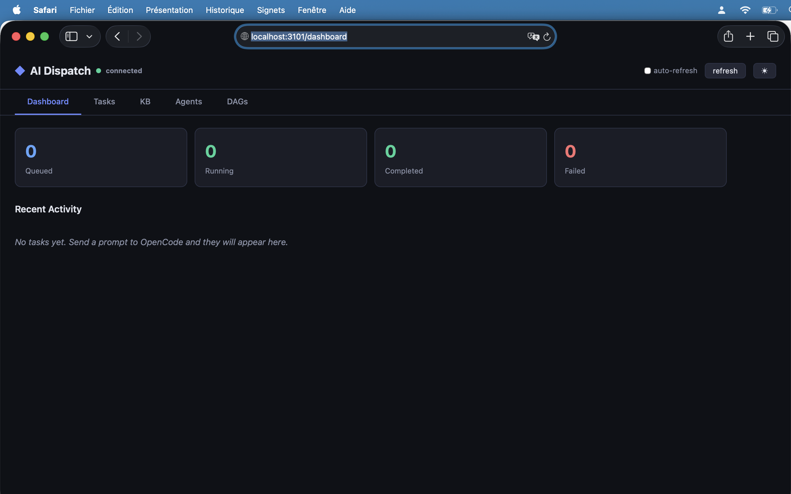
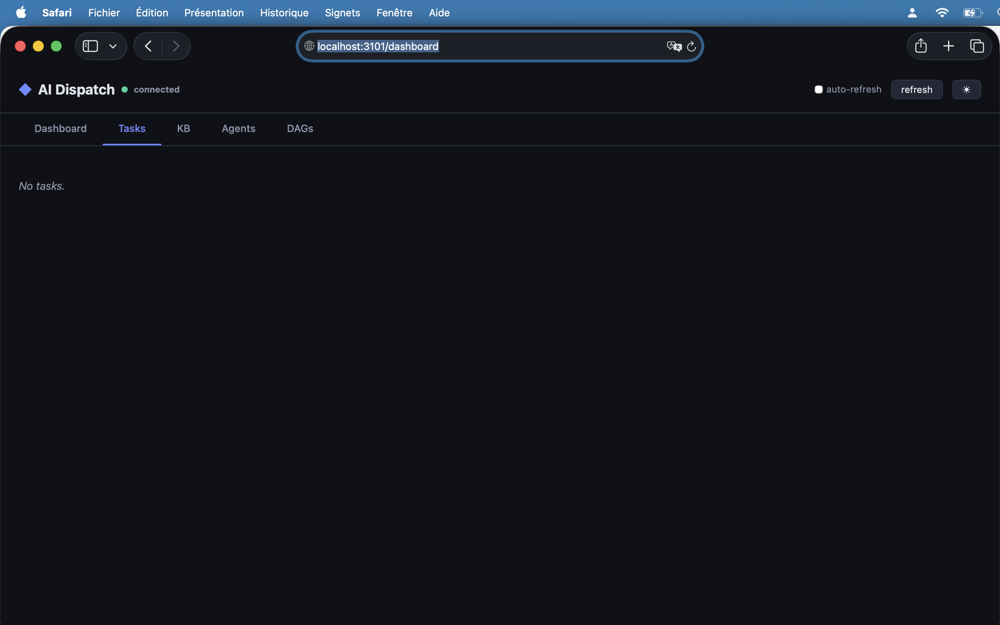
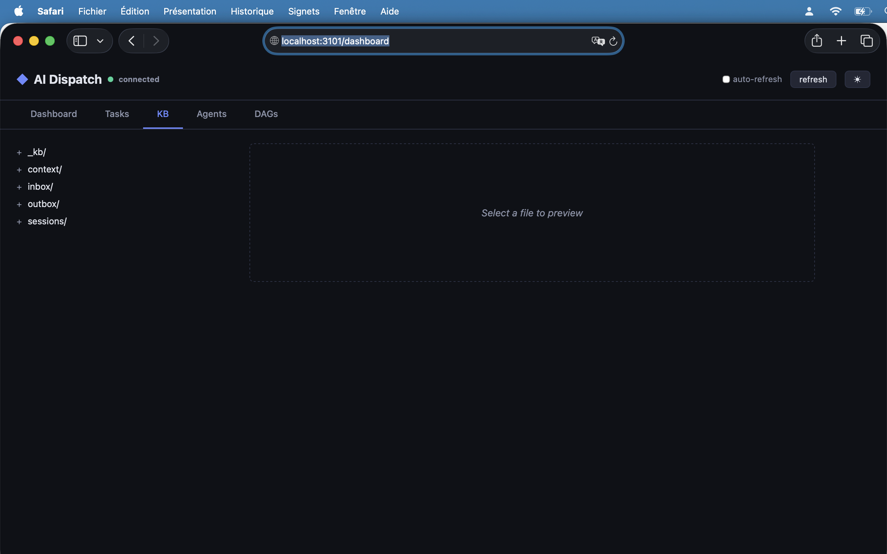
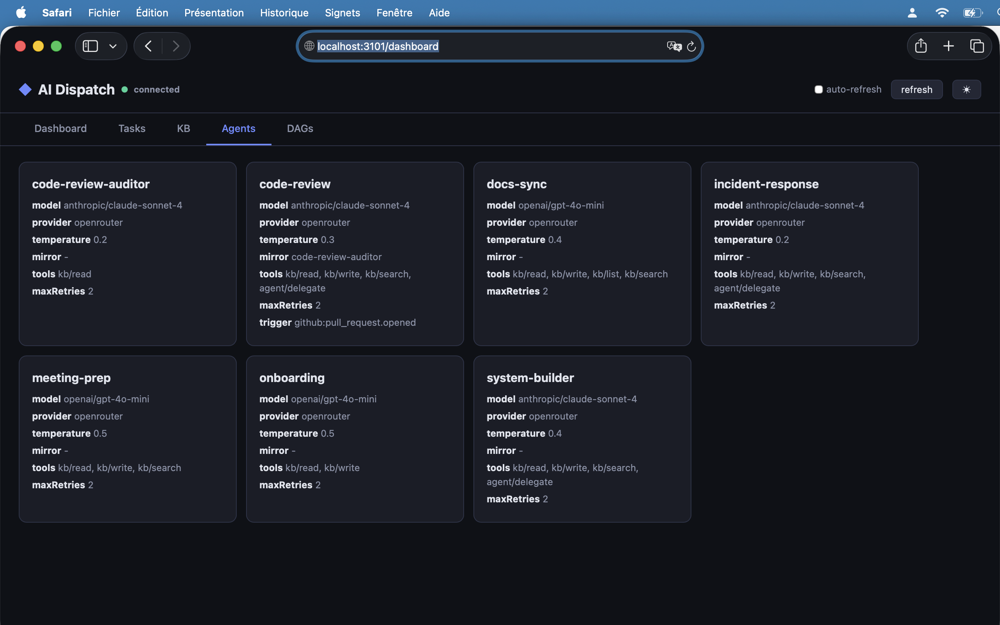
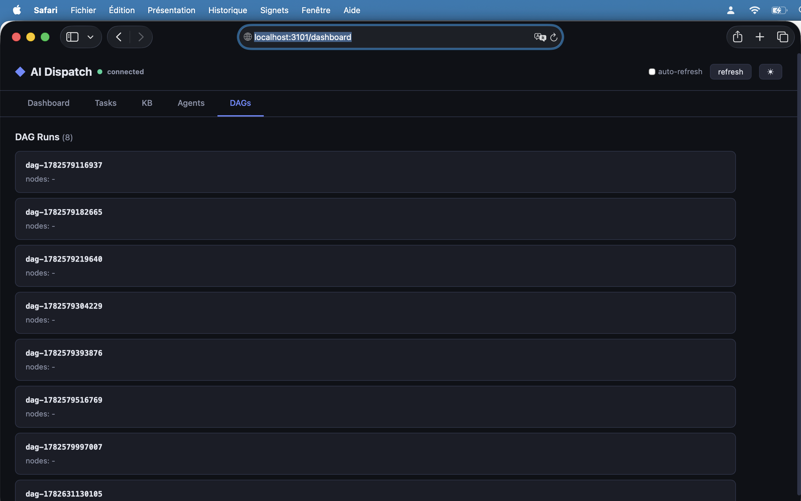

# Dashboard

The AI Dispatch Dashboard is a built-in web interface that gives you real-time visibility into the system — tasks, outputs, agents, and DAG runs — all in one place.



## Starting the Dashboard

The dashboard runs alongside the MCP server on a separate HTTP port. Start the server with the `--dashboard-port` flag:

```bash
cd packages/mcp-orchestrator
node dist/index.js --transport stdio --dashboard-port 3101
```

Open your browser to `http://localhost:3101/dashboard`.

The dashboard requires **no configuration** — it reads task state, the knowledge base, and agent configs directly from the running server process.

## Dashboard Tab

The home view shows a summary of the entire system:

- **Status cards** — Count of tasks by state: queued, running, completed, failed
- **Recent Activity** — Chronological list of the latest tasks with agent name, model used, current progress string, and mirror audit status

Each row shows the task ID (truncated), the agent that processed it, a color-coded status badge, the model that handled the LLM call, the real-time progress (e.g. "Calling anthropic/claude-sonnet-4..."), and the mirror audit result.

## Tasks Tab



A full table of all tasks in the system, with columns:

| Column | Description |
|--------|-------------|
| ID | Truncated task UUID |
| Agent | Name of the agent that processed it |
| Status | Color-coded badge (queued/running/completed/failed/cancelled) |
| Model | The LLM model used (e.g. `claude-4-sonnet-20250522`) |
| Progress | Real-time progress string set by the task handler |
| Retries | Retry count / max retries |
| Mirror | Mirror audit result (pass/fail/needs-revision) |
| Created | Time the task was created |

Tasks are listed in the order they were created. Poll `task/status` from the orchestrator or check the table to see live progress updates.

## KB Tab



A two-panel file browser for the knowledge base at `_kb/`:

- **Left panel** — Collapsible directory tree showing the full `_kb/` structure (inbox, outbox, context, sessions)
- **Right panel** — Preview of the selected file with **rendered markdown** (headings, bold, code blocks, lists, tables, blockquotes all styled)

Click any file in the tree to open its preview on the right. The preview panel supports markdown rendering, so review reports, onboarding plans, and DAG definitions display with proper formatting.

The tree preserves your file selection across auto-refresh cycles — when auto-refresh is enabled, the tree and preview update silently without resetting your view.

## Agents Tab



A card grid showing all registered agents with their configuration:

| Field | Description |
|-------|-------------|
| Name | Agent identifier (e.g. `code-review`) |
| Model | The LLM model assigned to this agent |
| Provider | Provider name (e.g. `openrouter`) |
| Temperature | Model temperature setting |
| Mirror | Assigned mirror/auditor agent |
| Tools | Allowed tool permissions |
| Max Retries | Maximum retry attempts |
| Trigger | CI/CD event trigger if configured |

Each card shows the agent's full configuration at a glance, making it easy to verify model assignments and permissions.

## DAGs Tab



A list of all DAG run sessions with their definitions. Each entry shows:

- **Run ID** — The auto-generated DAG run identifier
- **Nodes** — The node IDs in the DAG (e.g. `review, docs, notify`)
- **Status** — Overall run status

Click on a DAG run to see its stored definition from `_kb/sessions/`.

## Auto-Refresh

Each tab has an **auto-refresh** toggle in the header. When enabled:

- The dashboard polls the API every 3 seconds
- The KB tab uses a **gentle refresh** that preserves your file selection and scroll position
- Other tabs reload their full content on each refresh

Auto-refresh is **disabled by default** — enable it only when you need live monitoring.

## API Endpoints

The dashboard is powered by these REST API endpoints:

| Endpoint | Description |
|----------|-------------|
| `GET /api/health` | Server health check |
| `GET /api/tasks` | All tasks |
| `GET /api/tasks/counts` | Task counts by status |
| `GET /api/tasks/recent` | Most recent tasks |
| `GET /api/kb` | Recursive KB directory tree |
| `GET /api/kb/read?path=...` | Read a KB file |
| `GET /api/agents` | All registered agents |
| `GET /api/dag-runs` | All DAG run sessions |

## Dark / Light Theme

Click the theme button (☀ / 🌙) in the header to toggle between dark and light mode. The preference persists for the current session.
